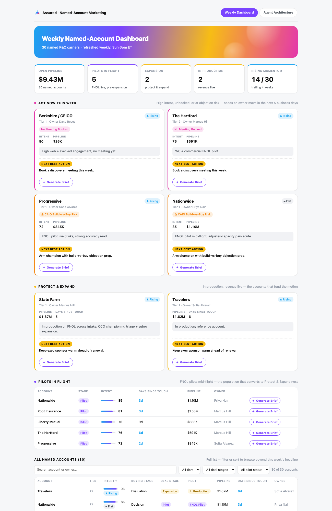
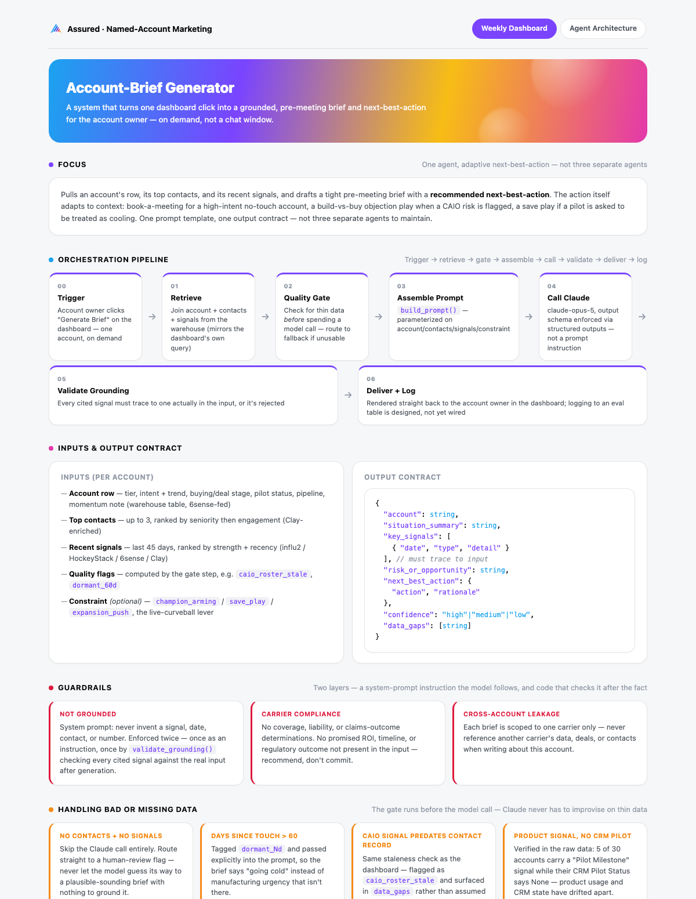

# Assured — Named-Account System

**Part 1** of the AI & Data Marketing Engineer panel exercise: a weekly named-account dashboard and the agentic workflow that powers it, built over the provided synthetic dataset (30 accounts, 42 contacts, 55 signals).

**Live dashboard:** https://claude.ai/code/artifact/afe742d6-4ebf-4bff-9a12-1de8fbd7b017
*(two tabs — Weekly Dashboard, Agent Architecture. If the link is unavailable, screenshots are below and everything needed to run it locally is in this repo.)*

---

## What's here

| File | What it is |
|---|---|
| `dashboard.html` | The weekly dashboard — self-contained HTML/CSS/JS, real dataset embedded inline |
| `agent-architecture.html` | The agent's system-architecture doc, same design system as the dashboard |
| `assured-system.html` | Both of the above combined into one tabbed page (what's published at the link) |
| `agent_account_brief.py` | The agent itself — real, tested Python, not pseudocode |
| `data/assured_data.json` | The provided dataset, as consumed by both the dashboard and the agent |
| `requirements.txt` | One dependency: the `anthropic` SDK |

Dashboard and agent read from the **same JSON snapshot**, so both surfaces are provably looking at one source of truth.

---

## The dashboard

A view the CEO and Head of Sales can read in under five minutes and immediately know where to focus this week and why — covering 30 named accounts, built around one question: *what deserves attention right now?*

- **Act Now This Week** — accounts with intent ≥ 60 and zero meetings booked, plus any account carrying a stale CAIO (Chief AI Officer) risk signal — a new AI decision-maker hired in, with no contact on record for that persona yet.
- **Protect & Expand** — accounts already in an Expansion deal stage.
- Full sortable/filterable account grid and a pilot-status mini table.
- A "Generate Brief" button on six accounts that opens a preview of what the **real agent below** produces for that account — clearly labeled **"Agent Preview — Not a Live Call"** because a published Artifact page can't safely hold an API key or make live authenticated calls (no server-side secret storage, CSP blocks arbitrary `fetch()`). The preview text is hand-written to match those six accounts' real data exactly; the agent that actually generates this kind of brief from scratch is a separate, fully working system — see **The agent**, below, and run it yourself with `python agent_account_brief.py`.

Styling pulls real hex values from assured.com's brand palette, mapped consistently to meaning across the whole page (e.g. magenta = act-now/no-meeting, orange = CAIO-risk specifically, red = cooling/closed-lost only) — not decorative color, every color is a label.



## The agent

**Focus: an account-brief generator.** Given an account, it retrieves that account's contacts and recent signals, runs a data-quality gate, assembles a grounded prompt, calls Claude for a structured JSON brief, validates that every cited signal actually exists in the input, and delivers/logs the result.

Rather than building three separate agents for the brief's three next-best-action options, next-best-action adapts via a single `constraint` parameter — `champion_arming`, `save_play`, or `expansion_push` — that changes what the prompt asks for without changing the pipeline.

```
Retrieve → Quality Gate → Assemble Prompt → Call Claude → Validate Grounding → Deliver + Log
```

**Quality gate** — routes to human review instead of guessing when there's nothing to ground a brief in, and flags (rather than blocks) partial-data cases:
- No contacts and no recent signal activity → `insufficient_data`, does not call the model
- Dormant 60+ days → flagged, brief still generated
- No recent signals → flagged
- CAIO hired, contact roster stale → flagged
- **`pilot_signal_status_mismatch`** — a real data-quality issue found while building this: 7 of 30 accounts carry a "Pilot Milestone" product signal while their CRM `Pilot Status` field still says `None`. Flagged so the brief never implies a pilot that isn't on record.

**Guardrails** enforced in the system prompt — every cited signal must literally exist in the input (checked as exact `(date, type, detail)` set membership post-hoc, not fuzzy-matched); no coverage/liability/claims-outcome determinations; no unsupported ROI/timeline/compliance promises; never reference another carrier's data.

**Output** is a structured JSON brief (`output_config.format: json_schema`, all fields required, `additionalProperties: false`) — not free text — so it can be rendered, logged, or piped into CRM/Slack without a parsing layer.

**Scheduling & observability** (designed in `agent-architecture.html`, not wired to live infra — see Assumptions):

| | |
|---|---|
| Weekly batch | Sun 18:00 ET — Act Now + Pilots list, ahead of Monday review |
| On-demand | A CRM webhook (meeting booked) fires a single synchronous call |
| Delivery | Slack + CRM note to the account owner |
| Eval | 5-account golden set, hand-graded, scored weekly by Claude-as-judge |
| Alerting | Grounding-check failure rate > 5% pages the on-call owner |
| Logging | Every run logs input, output, prompt version, latency, and token cost |

Run it (needs `ANTHROPIC_API_KEY` set):

```bash
pip install -r requirements.txt
python agent_account_brief.py
```

By default this generates a real brief for Progressive under the `champion_arming` constraint and prints the JSON. Swap the account name or constraint in the `if __name__ == "__main__"` block at the bottom of the file to try others.



## How this connects to Part 2

`build_prompt()` in `agent_account_brief.py` is the exact dynamic-prompt-assembly logic — parameterized on account, contacts, signals, and constraint — that Part 2 opens the hood on live: those become `{{variables}}` in Claude Console, and the constraint becomes the panel's curveball.

## Assumptions

- **Retrieval** is a static JSON snapshot standing in for three nightly-synced warehouse tables (6sense, Clay, influ2, HockeyStack) — same shape, no live warehouse connection assumed.
- **Scheduling/delivery infra** (cron trigger, Slack post, CRM write-back) is designed, not wired to live systems — described in the architecture doc as a credible plan rather than mocked code.
- **Model choice**: `claude-opus-5`, with extended thinking explicitly disabled (`thinking: {"type": "disabled"}`) — this is a bounded structured-generation task, not open-ended reasoning, and thinking otherwise shares the token budget with the JSON output.
- **"Recent" signal** = 45-day lookback window.
- **"Top contacts"** = ranked by seniority (C-Suite → Director) then by engagement, capped at 3.
- **Delivery target** = the account's `Account Owner` field.

---

*Dataset is the synthetic set provided for this exercise; no real Assured customer data is present.*
